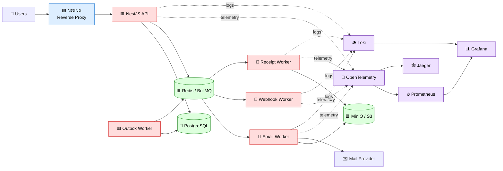
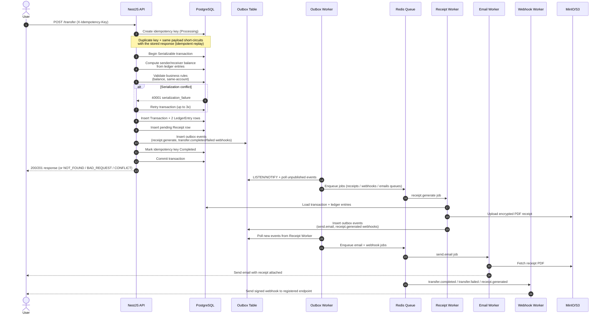
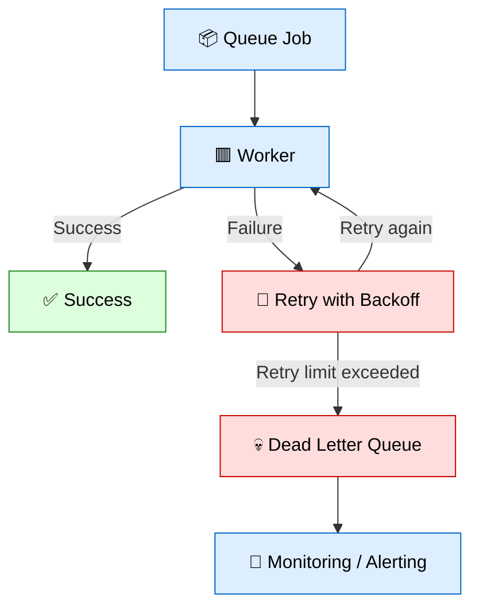
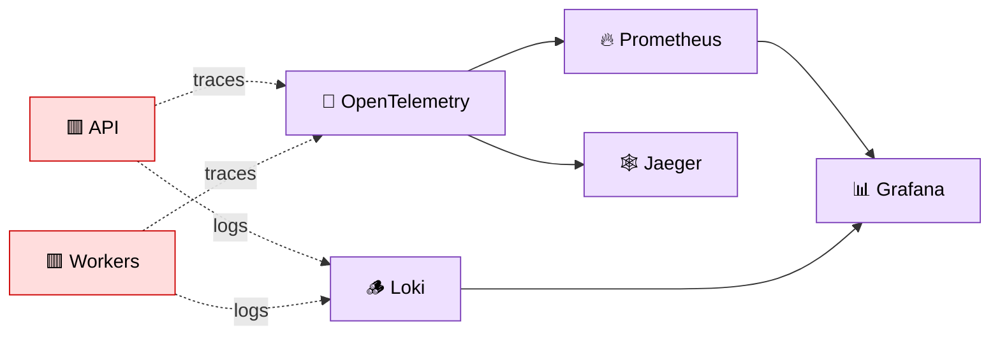
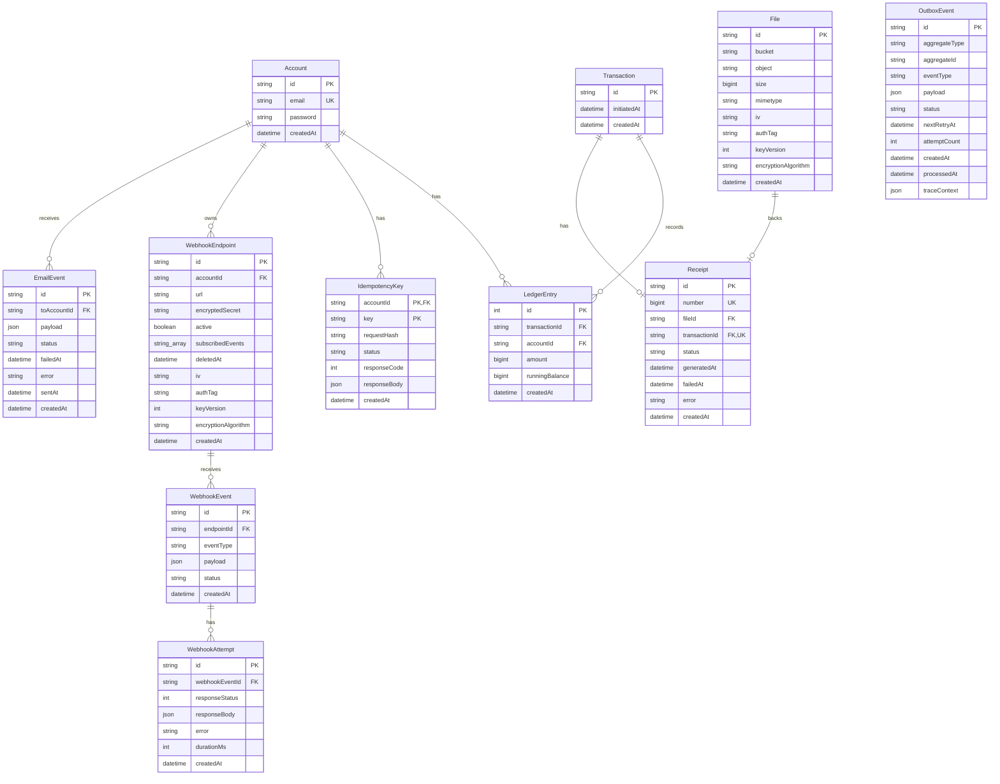
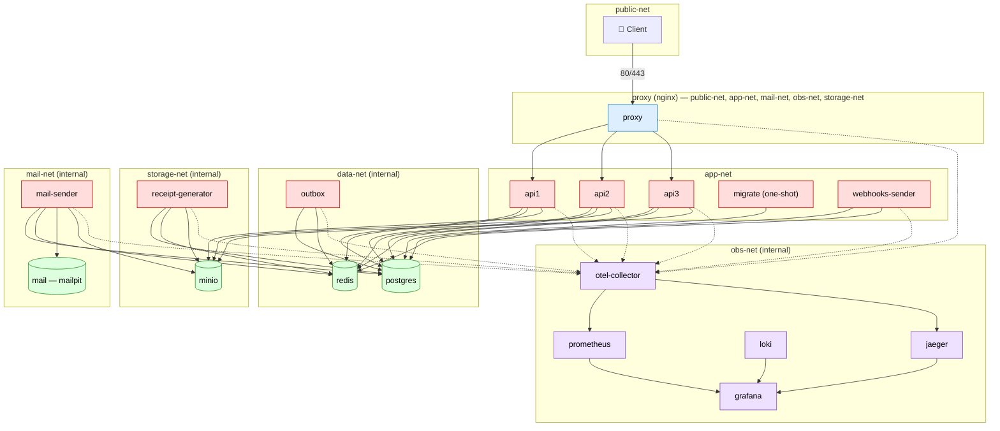

# Architecture

This document is the deep-dive companion to [README.md](./README.md). It contains system diagrams, the data
model, module boundaries, deployment topology, and the detailed request/reliability/security notes that don't
belong in a first-read overview.

- [High-Level System Architecture](#high-level-system-architecture)
- [Transfer Lifecycle](#transfer-lifecycle)
- [Retry + DLQ Flow](#retry--dlq-flow)
- [Observability Flow](#observability-flow)
- [Data Model (ER Diagram)](#data-model-er-diagram)
- [Module Boundaries](#module-boundaries)
- [Deployment Topology (Production)](#deployment-topology-production)
- [Request Lifecycle](#request-lifecycle)
- [Reliability Considerations](#reliability-considerations)
- [Security Considerations](#security-considerations)

---

## High-Level System Architecture

---

## Transfer Lifecycle

> Updated to match the current implementation (`transactions.service.ts`, `ledger.service.ts`,
> `idempotency.service.ts`, `outbox.service.ts`, `receipt-generator.ts`). See
> [Discrepancies from the previous diagram](#discrepancies-from-the-previous-diagram) below for what changed.

### Discrepancies from the previous diagram

While updating this document the transaction/ledger/idempotency/outbox code was re-read to verify the old
README diagram still matched reality. It no longer did, in a few concrete ways:

1. **No explicit row lock.** The old diagram said "Lock sender account row." The current implementation does
   not take an explicit row lock — it runs the whole balance-check-and-write inside a Postgres
   `Serializable` transaction and retries on `40001 serialization_failure` (up to 3 attempts,
   `transactions.service.ts::createTransaction`). Concurrency safety comes from isolation level + retry, not
   `SELECT ... FOR UPDATE`.
2. **Idempotency key is written before the transfer transaction**, not implied as part of it. It's created
   `Processing` up front (unique constraint gives race protection), and completed inside the same
   transaction as the ledger writes on the happy path — or in a separate "finalize" pass only when the main
   transaction threw before a terminal result could be decided (`finalize()` fallback).
3. **Receipt generation is not just "upload PDF."** The receipt worker itself writes new outbox events
   (`send.email` per participant, `receipt.generated` webhook events) after the PDF is uploaded — it does not
   hand off directly to the email/webhook queues. Those new outbox rows are picked up by another poll cycle
   of the Outbox Worker before the email/webhook workers ever see them. The old diagram showed the outbox
   worker fanning out to all three workers in one pass and the email worker fetching the receipt directly
   after a single hop — that's no longer accurate.
4. **Outbox events carry OpenTelemetry trace context** (`traceContext` column) so spans in the async workers
   link back to the originating request's trace — not shown at all in the old diagram.
5. Failed transfers (insufficient balance, same-account, destination-not-found) also produce outbox-driven
   `transfer.failed` webhook events, written atomically with the rejection — this failure path wasn't
   represented previously.

---

## Retry + DLQ Flow

---

## Observability Flow

---

## Data Model (ER Diagram)

Generated directly from `prisma/schema.prisma`. Balances are never stored — `Account` balance is derived by
summing/reading the latest `LedgerEntry.runningBalance` for that account.

Notes:

- `OutboxEvent` is intentionally not linked by foreign key to `Transaction`/`WebhookEndpoint` — `aggregateId`
  is a loosely-typed polymorphic reference (e.g. `"<transactionId>:<endpointId>"`), consistent with the
  outbox pattern decoupling producers from consumers.
- `LedgerEntry` has a `@@unique([transactionId, accountId])` constraint — each transaction can only post one
  entry per account (i.e. exactly the debit and the credit leg).
- `IdempotencyKey` has a composite primary key `(accountId, key)` rather than its own `id`.
- `Receipt.number` is a separate auto-incrementing sequence used as the human-facing receipt number, distinct
  from the ULID `id`.

---

## Module Boundaries

The codebase is a single NestJS source tree (`src/`) that is bootstrapped into **five separate processes**,
each with its own `nest-cli.*.json` build config and its own `main.*.ts` entrypoint. Only the API process
boots the shared `AppModule`; every worker process boots its **own standalone module** — they do not import
`AppModule` and do not share its HTTP/guard/throttler wiring.

| Process | Entrypoint | Nest CLI config | Root module |
|---|---|---|---|
| API | `src/main.api.ts` | `nest-cli.api.json` | `AppModule` |
| Outbox worker | `src/main.outbox.ts` | `nest-cli.outbox.json` | `OutboxModule` (standalone) |
| Mail sender worker | `src/main.mail.ts` | `nest-cli.mail.json` | `MailSenderModule` (standalone) |
| Receipt generator worker | `src/main.receipt.ts` | `nest-cli.receipt.json` | `ReceiptGeneratorModule` (standalone) |
| Webhooks sender worker | `src/main.webhooks.ts` | `nest-cli.webhooks.json` | `WebhooksSenderModule` (standalone) |

`AppModule` (API process) composes: `ConfigModule`, `UsersModule`, `PrismaModule`, `LoggerModule`,
`AuthModule`, `TransactionsModule`, `WebhooksModule`, `ThrottlerModule`, `MetricsModule`, `HealthModule`.

```mermaid
flowchart TB
    subgraph API_PROCESS["API process — main.api.ts → AppModule"]
        AppModule
        AuthModule
        UsersModule["UsersModule (accounts)"]
        TransactionsModule
        WebhooksModule
        HealthModule
        MetricsModule
        ThrottlerModule
    end

    subgraph OUTBOX_PROCESS["Outbox process — main.outbox.ts"]
        OutboxModule
    end

    subgraph MAIL_PROCESS["Mail process — main.mail.ts"]
        MailSenderModule
    end

    subgraph RECEIPT_PROCESS["Receipt process — main.receipt.ts"]
        ReceiptGeneratorModule
    end

    subgraph WEBHOOKS_PROCESS["Webhooks process — main.webhooks.ts"]
        WebhooksSenderModule
    end

    subgraph SHARED["Shared library modules (imported by multiple processes)"]
        PrismaModule
        LoggerModule
        QueuesModule["QueuesModule (BullMQ)"]
        MailModule["MailModule (@nestjs-modules/mailer)"]
        MinioModule
        ReceiptsModule
    end

    AppModule --> AuthModule
    AppModule --> UsersModule
    AppModule --> TransactionsModule
    AppModule --> WebhooksModule
    AppModule --> HealthModule
    AppModule --> MetricsModule
    AppModule --> ThrottlerModule
    AppModule --> PrismaModule
    AppModule --> LoggerModule

    AuthModule --> UsersModule
    TransactionsModule --> PrismaModule
    TransactionsModule --> WebhooksModule
    WebhooksModule --> PrismaModule
    UsersModule --> PrismaModule
    HealthModule --> PrismaModule
    MetricsModule --> PrismaModule
    MetricsModule --> QueuesModule

    OutboxModule --> QueuesModule
    OutboxModule --> PrismaModule
    OutboxModule --> LoggerModule

    MailSenderModule --> PrismaModule
    MailSenderModule --> LoggerModule
    MailSenderModule --> QueuesModule
    MailSenderModule --> ReceiptsModule
    MailSenderModule --> MailModule
    ReceiptsModule --> PrismaModule
    ReceiptsModule --> MinioModule

    ReceiptGeneratorModule --> PrismaModule
    ReceiptGeneratorModule --> QueuesModule
    ReceiptGeneratorModule --> MinioModule
    ReceiptGeneratorModule --> MailModule
    ReceiptGeneratorModule --> LoggerModule
    ReceiptGeneratorModule --> WebhooksModule
    ReceiptGeneratorModule --> ReceiptsModule

    WebhooksSenderModule --> WebhooksModule
    WebhooksSenderModule --> QueuesModule
    WebhooksSenderModule --> PrismaModule
    WebhooksSenderModule --> LoggerModule

    classDef process fill:#ddeeff,stroke:#0066cc,color:#000;
    classDef shared fill:#ddffdd,stroke:#228822,color:#000;
    class AppModule,OutboxModule,MailSenderModule,ReceiptGeneratorModule,WebhooksSenderModule process;
    class PrismaModule,LoggerModule,QueuesModule,MailModule,MinioModule,ReceiptsModule shared;
```

Notable cross-cutting facts:

- `WebhooksModule` is imported by three of the five processes (API, receipt generator, webhooks sender) —
  it's the shared home for `WebhooksService` (endpoint CRUD + lookup used to decide who to notify), while
  actual HTTP delivery lives in `webhooks-sender/webhooks-sender.ts` (the `Processor`).
- `MailModule` (the `@nestjs-modules/mailer` wrapper) is `@Global()` and consumed by both the mail sender and
  the receipt generator (the receipt generator also sends mail failure notifications).
- `MinioModule` is also `@Global()` — consumed by `ReceiptsModule` for object storage, in turn used by both
  the receipt generator and mail sender processes.
- Every worker process (`OutboxModule`, `MailSenderModule`, `ReceiptGeneratorModule`,
  `WebhooksSenderModule`) declares its own `ConfigModule.forRoot({ isGlobal: true, ... })` with its own Joi
  validation schema scoped to just the env vars that process needs — they do not inherit `AppModule`'s
  config validation.
- `MetricsModule` and `HealthModule` are API-process-only; workers currently expose metrics/health
  differently (or not at all) since they don't run an HTTP listener.

---

## Deployment Topology (Production)

Reflects `compose.prod.yml` exactly — service list and the real Docker network names/attachments
(`public-net`, `app-net`, `storage-net` (internal), `mail-net` (internal), `data-net` (internal), `obs-net`
(internal)).

Notes verified against `compose.prod.yml`:

- `proxy` is the only service attached to `public-net`; it also joins `app-net`, `mail-net`, `obs-net`, and
  `storage-net` so it can reverse-proxy to internal dashboards (Grafana, Jaeger UI, Mailpit UI, MinIO
  console) as well as the API.
- `storage-net`, `mail-net`, `data-net`, and `obs-net` are all declared `internal: true` — only reachable
  from containers explicitly joined to them, not from the host or `public-net`.
- `api1`/`api2`/`api3` are 3 replicas of the same image behind `proxy`, each on `app-net` + `data-net` +
  `obs-net`. None of them are on `storage-net` or `mail-net` — MinIO/mail access for user-facing requests
  happens indirectly through the async workers, not the API itself directly serving files.
  (Note: `api*` services do connect to `minio` per their `depends_on`, but MinIO's `storage-net` isn't listed
  under `api1/2/3`'s `networks:` — this is a latent inconsistency in `compose.prod.yml` itself, called out
  here rather than silently "fixed" in the diagram, since diagrams here are meant to mirror the compose file.)
- `outbox`, `mail-sender`, `receipt-generator`, `webhooks-sender` are all one-replica worker processes;
  `mail-sender` is the only one attached to `mail-net`; `receipt-generator` and `mail-sender` are the only
  ones on `storage-net` (MinIO).
- `migrate` runs once (`service_completed_successfully` gate) before any API or worker container starts.

---

## Request Lifecycle

A typical money transfer follows this flow:

1. Client sends transfer request with `Authorization: Bearer <jwt>` and `X-Idempotency-Key`
2. API validates authentication (`JwtAuthGuard`) and rate limits (`ThrottlerModule` / `@Throttle`)
3. API checks/creates the idempotency key row (duplicate key + same payload short-circuits with the stored
   response; duplicate key + different payload is rejected)
4. A `Serializable` database transaction begins (retried up to 3x on serialization conflicts)
5. Ledger entries are inserted for both the sender and receiver
6. A `Transaction` record and pending `Receipt` row are created
7. Outbox events are inserted atomically (receipt generation + completed/failed webhook fan-out)
8. The idempotency key is marked `Completed` and the transaction commits
9. Outbox worker (`LISTEN/NOTIFY` + polling fallback) publishes async jobs to Redis/BullMQ queues
10. Workers process, in cascading stages:
    - receipt generation (PDF to MinIO, encrypted at rest)
    - a second outbox round trip for email delivery + `receipt.generated` webhooks
    - email delivery
    - webhook delivery (signed payloads)

This architecture separates:

- balance-critical synchronous operations (steps 1-8, target: sub-second)

from:

- non-critical eventual-consistency workflows (step 9-10, offloaded entirely to background workers)

---

## Reliability Considerations

### Idempotency

Transfers require an `X-Idempotency-Key` header. The key + a hash of the request body are stored per
account (`IdempotencyKey`, composite PK `(accountId, key)`); a retried/duplicate request with the same key
and body replays the original stored response instead of re-executing the transfer. Reusing a key with a
different payload is rejected with `400`; a concurrent duplicate still mid-flight is rejected with `409`.

### Concurrency Control

Balance-affecting transactions run at Postgres `Serializable` isolation and are retried (up to 3 attempts)
on `40001 serialization_failure`, rather than relying on explicit row locks. This prevents lost updates and
negative balances under concurrent transfers against the same account.

### Retries and DLQs

BullMQ workers retry failed jobs with backoff. Jobs exceeding retry limits are moved into dedicated DLQ
queues (e.g. `ReceiptsDLQ`) for inspection and replay, and the failure is recorded on the originating
domain row (e.g. `Receipt.status = Failed`) so it's queryable without digging through queue state.

### Failure Isolation

External integrations — email providers, webhook targets, PDF generation/object storage — are isolated
behind async workers so a slow or failing dependency never blocks the synchronous transfer path.

### Outbox Delivery Guarantee

Outbox events are only ever inserted inside the same DB transaction as the domain writes they describe, so
a committed transfer can never "lose" its downstream side effects to a crashed process between the DB write
and the queue publish. The outbox worker uses `SELECT ... FOR UPDATE SKIP LOCKED` when claiming a batch, so
multiple outbox worker instances (if scaled out) can't double-process the same event.

---

## Security Considerations

- Signed webhook payloads, verified via a per-endpoint secret
- Webhook secrets and receipt files are encrypted at rest (AES, versioned key + IV/auth tag stored alongside
  the ciphertext in `webhook_endpoints` / `files`)
- JWT authentication (`JwtAuthGuard`), 30-minute token expiry
- Rate limiting via `ThrottlerModule`, both a global default and per-route `@Throttle` overrides (see
  [docs/API.md](./docs/API.md))
- Request tracing (OpenTelemetry) and structured audit logging (Winston + Loki), including trace/span IDs
  attached to log lines
- Webhook events carry event IDs for idempotency checks on the receiving end

This is not intended to be a production-ready banking platform. The project focuses primarily on backend
systems learning and reliability exploration.
