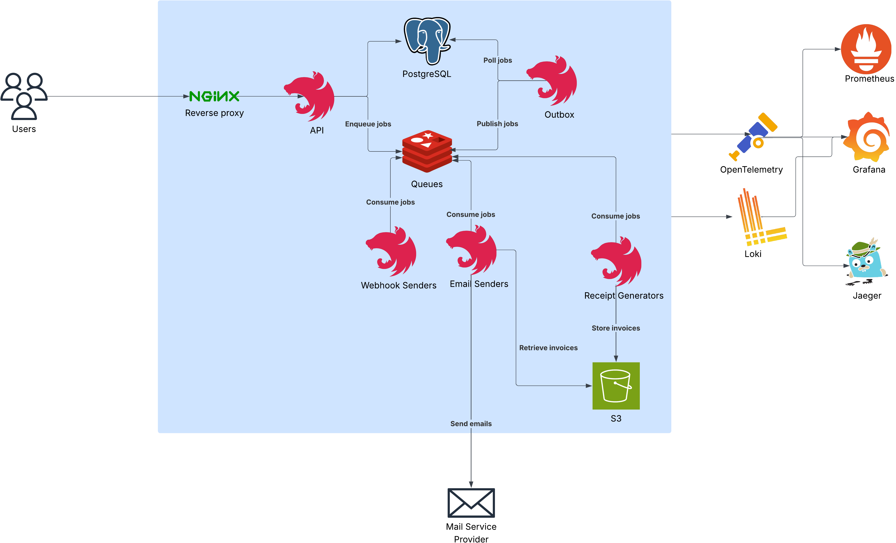

# Banking System

## Overview
This is a **backend-only simulation** of a banking system that enables two accounts to send and receive money.

The purpose of building the system is to learn:
- Transactional outbox pattern
- Job retries and DLQs
- Ledger entries to derive account balance
- Idempotency
- Database transaction isolation level
- Observability and structured logging
- Reverse proxy
- Encryption
- Rate limiting (simple fixed window algorithm)

What's not included (for now):
* Frontend
* Secure auth
* Clean code
* High-coverage testing
* HTTPS and DNS configurations
* Advanced rate limiting strategies

## Requirements

### Functional Requirements

- FR-01: Register an account (email, password)
- FR-02: Sign in to an existing account (email, password)
- FR-03: Transfer money to another account
- FR-04: View the account balance
- FR-05: Both the sender and receiver must receive an email after the transaction.
- FR-06: The email should include a **transfer receipt (PDF)** as an attachment
- FR-07: Manage Webhook Endpoints
    - Create a webhook endpoint (URL)
    - Generate/store secret
    - Enable/disable endpoint
    - Select subscribed events (`transfer.completed`, `transfer.failed`, `receipt.generated`)
    - Delete endpoint
- FR-08: All active registered endpoints associated with the sender and receiver must receive webhook requests after the transaction

### Non-Functional Requirements

#### Observability
- NFR-01: Every request should have tracing info
- NFR-02: Every HTTP requests and important worker events (success, fail, retry) must be logged

#### Security
- NFR-04: Sending webhook events must include a secure signature in the request header and event ID for idempotency checks
- NFR-06: Transaction API endpoint should be rate-limited per IP and account (authenticated endpoints) to prevent abuse
- NFR-10: Receipts and webhook secrets must be encrypted at rest

#### Performance
- NFR-05: Transactions should happen under 1 second (background jobs for non-customer-facing tasks)

#### Data Integrity
- NFR-03: The balance must never be negative despite multiple concurrent transactions.
- NFR-07: The balance must be derived from the ledger table, not a single value.
- NFR-08: Transactions must be idempotent, and don’t charge twice

#### Robustness
- NFR-09: Repeatedly failed jobs must be sent to DLQ

## Tech Stack

### Framework
**NodeJS** and **NestJS** to build the backend due to clean and standardized OO architectural patterns. They are used to build both the API and the workers

### Authentication strategy
**JWT** for simple authentication with very short-lived access tokens (30 minutes) and no refresh token for now to mitigate account impersonation

### Databases

- **PostgreSQL** for the primary database due to its ACID property, isolation level, row-locking feature that are essential for data integrity in the payment system
- **Redis** with **BullMQ** for job queue because it fits NodeJS harmoniously with minimal setup compared to RabbitMQ while minimizing job loss with RDB + AOF. Also, **Redis** is used as a storage for rate limiting.

### Observability
- **Prometheus** for analytics tracking and real-time monitoring
- **OpenTelemetry (OTel)** for observability, tracing and metrics collection
- **Grafana** dashboard for analysis and visualization based on the data gathered from Prometheus and OpenTelemetry
- **Loki** for log collection with Winston (although it can integrate with OTel, the library isn't that mature)
- **Jaeger** for trace visualization (in-memory storage for now, feel free to add storage like Elasticsearch)
- **Mailpit** for sending and receiving emails locally

### File Storage
**MinIO** for S3-like storage

### Containerization
**Docker**

## Architecture



The system architecture consists of these main components:
- A reverse proxy (nginx) to receive requests from the clients and forward them to the APIs through different load balancing methods.
- An API gateway to receive requests.
- Outbox workers to ensure jobs are both stored in the database and enqueued atomically. Once ledger entries are successfully stored in the database, outbox events are also stored in the database within the same database transaction. These outbox workers run in separate processes to poll these outbox events from the database and enqueue them in Redis.
- 3 types of workers: webhook senders, sending emails and generating PDF receipts. Each of which can be scaled based on actual demands. They consume jobs enqueued by outbox workers, retry failed jobs and store them in DLQs if they repeatedly failed.
- Observability infra: OTel collector receives, processes and exports traces to Jager for visualization, and metrics to Prometheus.
- Loki directly connects to NestJS Winston to collect logs, which are then exported to Grafana for queries and visualization.

## Setup & Installation
### Prerequisites
* Node.js 22 or higher (not needed for production use)
* Docker

Clone the repo:
```bash
git clone https://github.com/alphatrann/banking-system.git
```

### Production

Copy `.env.example` to `.env.production.local`
```bash
cp .env.example .env.production.local
```

Then modify the environment variables in the copied file based on your needs.

Start Docker compose stack for production (remember to start Docker Desktop first):
```bash
docker compose -f compose.prod.yml up -d
```

The API is available at [localhost](http://localhost). Feel free to practice deploying to a VPS and config HTTPS and domain names.

### Development
Install yarn if you haven't
```bash
npm i -g yarn@latest
```

Install all the dependencies
```bash
yarn
```

Copy `.env.example` to `.env.development.local`
```bash
cp .env.example .env.development.local
```

Then modify the environment variables in the copied file based on your needs.

Start Docker compose stack for development (remember to start Docker Desktop first):
```bash
docker compose -f compose.dev.yml up -d
```

Apply Prisma migrations
```bash
yarn migrate:deploy:dev
```

Run each command below **in separate terminals** to start API and workers development servers:
```bash
yarn start:dev:api # API
yarn start:dev:outbox # Outbox worker
yarn start:dev:mail # Mail sender
yarn start:dev:receipt # Receipt generator
yarn start:dev:webhooks # Webhooks sender
```

The API is available at [localhost:5000](http://localhost:5000)


There are only 3 e2e tests in the [test/ directory](./test/), run them by:
```bash
sh e2e.sh
```

You can read all the available scripts in the [package.json file](./package.json).

## Dashboards
### Development
* Jaeger UI: [localhost:16686](http://localhost:16686)
* Mailpit Inbox: [localhost:8025](http://localhost:8025)
* Grafana: [localhost:3000](http://localhost:3000)
* MinIO [localhost:9001](http://localhost:9001): login with the username and password in the `.env.development.local` file

### Production
All the dashboards are configured with `localhost` subdomains:

* Jaeger UI: [jaeger.localhost](http://jaeger.localhost)
* Mailpit Inbox: [mail.localhost](http://mail.localhost)
* Grafana: [grafana.localhost](http://grafana.localhost)
* MinIO [minio.localhost](http://minio.localhost): login with the username and password in the `.env.production.local` file

## License

[MIT](./LICENSE)