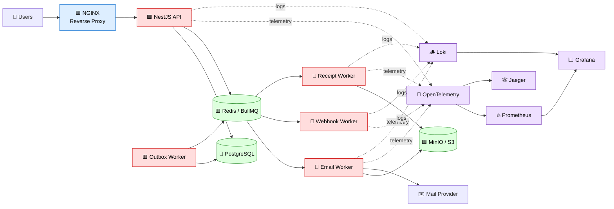
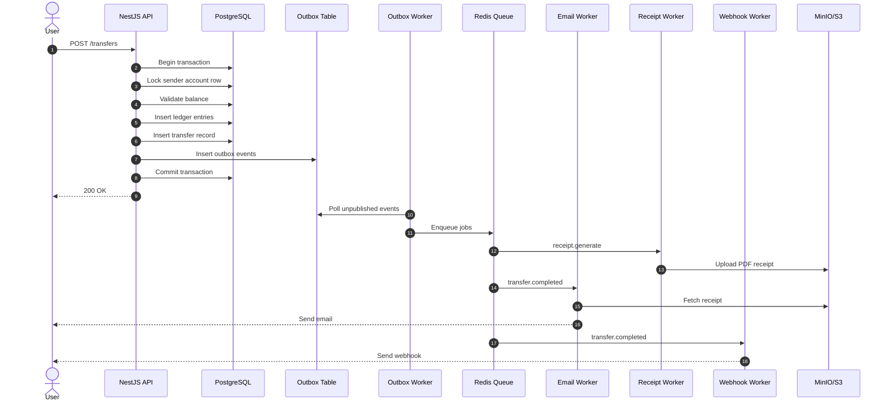
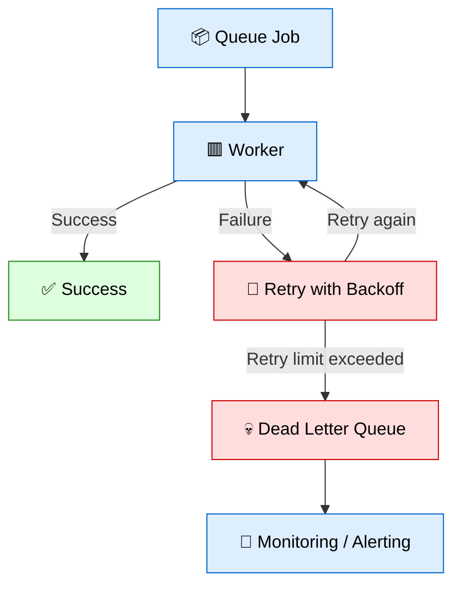
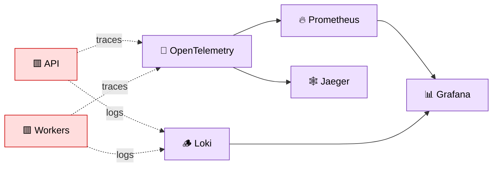

# Banking System

A backend-focused banking system simulation designed to explore transactional integrity, asynchronous workflows, reliability patterns, and observability in distributed backend systems.

The project intentionally prioritizes backend engineering concepts over product completeness. It explores patterns commonly used in financial and event-driven systems such as transactional outbox, idempotent transaction processing, ledger-based accounting, retries with DLQs, and distributed tracing.

---

# Motivation

This project was built to gain hands-on experience with:

* Transactional outbox pattern
* Idempotent transaction processing
* Ledger-based accounting systems
* Background job processing
* Retries and dead-letter queues (DLQs)
* Database transaction isolation and row locking
* Async workflow orchestration
* Observability and distributed tracing
* Secure webhook delivery
* Encryption at rest
* Reverse proxies and containerized infrastructure

The architecture intentionally explores production-inspired backend reliability patterns rather than optimizing for MVP simplicity.

---

# Features

## Functional Requirements

* Register an account
* Authenticate with JWT-based login
* Transfer money between accounts
* View account balances
* Generate PDF transfer receipts
* Send email notifications after transfers
* Register and manage webhook endpoints
* Deliver signed webhook events asynchronously

## Non-Functional Requirements

### Data Integrity

* Account balances are derived from immutable ledger entries
* Concurrent transfers must never produce negative balances
* Transfers are idempotent and safe against duplicate requests
* Critical balance operations execute inside database transactions

### Performance

* User-facing transfer requests should complete under 1 second
* Non-critical workflows are offloaded asynchronously

### Reliability

* Failed jobs are retried with backoff
* Repeatedly failing jobs are moved into DLQs
* Outbox pattern prevents event loss between DB writes and queue publishing

### Security

* Webhook deliveries include signed payloads
* Webhook events include event IDs for idempotency checks
* Receipts and webhook secrets are encrypted at rest
* Transaction endpoints are rate limited

### Observability

* Every request includes distributed tracing metadata
* Important events are logged with structured logging
* Metrics and traces are exported for monitoring and analysis

---

# Key Engineering Decisions

## Ledger-Based Accounting

Balances are not stored as mutable values. Instead, balances are derived from immutable ledger entries.

This design improves:

* auditability
* consistency
* transaction traceability
* corruption resistance

It also mirrors how many real financial systems model account state.

---

## Transactional Outbox Pattern

Transfer-related events are written into an outbox table within the same database transaction as ledger updates.

An outbox worker later polls unpublished events and publishes jobs into Redis queues.

This prevents situations where:

* database writes succeed
* but async jobs fail to enqueue

which could otherwise produce inconsistent side effects.

---

## Async Processing

Customer-facing transaction APIs only handle balance-critical operations synchronously.

Non-user-facing workflows are processed asynchronously:

* email delivery
* webhook delivery
* receipt generation

This keeps request latency predictable while isolating slower external operations.

---

## PostgreSQL for Strong Consistency

PostgreSQL was chosen because transactional guarantees are critical for financial operations.

The system uses:

* ACID transactions
* row-level locking
* transaction isolation
* atomic writes

to protect against race conditions and invalid balances during concurrent transfers.

---

## Redis + BullMQ

Redis with BullMQ was selected for:

* lightweight operational setup
* good NodeJS ecosystem integration
* retry support
* delayed jobs
* DLQ workflows

The project intentionally avoids introducing heavier infrastructure such as Kafka or RabbitMQ since the learning focus is reliability patterns rather than high-throughput distributed streaming.

---

# Tech Stack

## Backend

* NodeJS
* NestJS

## Databases

* PostgreSQL
* Redis
* BullMQ

## Storage

* MinIO (S3-compatible object storage)

## Observability

* OpenTelemetry
* Prometheus
* Grafana
* Loki
* Jaeger

## Infrastructure

* Docker
* NGINX

---

# Architecture

## High-Level System Architecture


```mermaid
flowchart LR
    %% Clients
    U[👥 Users]

    %% Edge
    NGINX["🟩 NGINX<br/>Reverse Proxy"]

    %% API Layer
    API["🟥 NestJS API"]

    %% Core Infra
    PG[(🐘 PostgreSQL)]
    REDIS[(🟥 Redis / BullMQ)]
    S3[(🟩 MinIO / S3)]

    %% Workers
    OUTBOX["🟥 Outbox Worker"]
    MAIL["📧 Email Worker"]
    WEBHOOK["🔔 Webhook Worker"]
    RECEIPT["🧾 Receipt Worker"]

    %% External
    EMAIL["✉️ Mail Provider"]

    %% Observability
    OTEL["📡 OpenTelemetry"]
    PROM["🔥 Prometheus"]
    GRAF["📊 Grafana"]
    LOKI["🪵 Loki"]
    JAEGER["🕸️ Jaeger"]

    %% Flow
    U --> NGINX --> API

    API --> PG
    API --> REDIS

    OUTBOX --> PG
    OUTBOX --> REDIS

    REDIS --> MAIL
    REDIS --> WEBHOOK
    REDIS --> RECEIPT

    RECEIPT --> S3
    MAIL --> S3

    MAIL --> EMAIL

    API -. telemetry .-> OTEL
    MAIL -. telemetry .-> OTEL
    WEBHOOK -. telemetry .-> OTEL
    RECEIPT -. telemetry .-> OTEL

    OTEL --> PROM
    OTEL --> JAEGER

    API -. logs .-> LOKI
    MAIL -. logs .-> LOKI
    WEBHOOK -. logs .-> LOKI
    RECEIPT -. logs .-> LOKI

    PROM --> GRAF
    LOKI --> GRAF

    %% Styling
    classDef api fill:#ffdddd,stroke:#cc0000,color:#000;
    classDef infra fill:#ddeeff,stroke:#0066cc,color:#000;
    classDef worker fill:#fff0cc,stroke:#cc8800,color:#000;
    classDef obs fill:#eee0ff,stroke:#7a3db8,color:#000;
    classDef storage fill:#ddffdd,stroke:#228822,color:#000;

    class API,OUTBOX,MAIL,WEBHOOK,RECEIPT api;
    class PG,REDIS,S3 storage;
    class OTEL,PROM,GRAF,LOKI,JAEGER obs;
    class NGINX infra;
```

---

## Transfer Lifecycle


```mermaid
sequenceDiagram
    autonumber

    actor User
    participant API as NestJS API
    participant DB as PostgreSQL
    participant OUTBOX as Outbox Table
    participant WORKER as Outbox Worker
    participant QUEUE as Redis Queue
    participant EMAIL as Email Worker
    participant RECEIPT as Receipt Worker
    participant WEBHOOK as Webhook Worker
    participant S3 as MinIO/S3

    User->>API: POST /transfers

    API->>DB: Begin transaction

    API->>DB: Lock sender account row
    API->>DB: Validate balance

    API->>DB: Insert ledger entries
    API->>DB: Insert transfer record

    API->>OUTBOX: Insert outbox events

    API->>DB: Commit transaction

    API-->>User: 200 OK

    WORKER->>OUTBOX: Poll unpublished events
    WORKER->>QUEUE: Enqueue jobs

    QUEUE->>RECEIPT: receipt.generate
    RECEIPT->>S3: Upload PDF receipt

    QUEUE->>EMAIL: transfer.completed
    EMAIL->>S3: Fetch receipt
    EMAIL-->>User: Send email

    QUEUE->>WEBHOOK: transfer.completed
    WEBHOOK-->>User: Send webhook
```

---

## Retry + DLQ Flow


```mermaid
flowchart TD

    JOB["📦 Queue Job"]
    WORKER["🟥 Worker"]

    SUCCESS["✅ Success"]
    RETRY["🔁 Retry with Backoff"]
    DLQ["💀 Dead Letter Queue"]

    ALERT["🚨 Monitoring / Alerting"]

    JOB --> WORKER

    WORKER -->|Success| SUCCESS

    WORKER -->|Failure| RETRY

    RETRY -->|Retry limit exceeded| DLQ
    RETRY -->|Retry again| WORKER

    DLQ --> ALERT

    classDef success fill:#ddffdd,stroke:#228822,color:#000;
    classDef fail fill:#ffdddd,stroke:#cc0000,color:#000;
    classDef process fill:#ddeeff,stroke:#0066cc,color:#000;

    class SUCCESS success;
    class RETRY,DLQ fail;
    class JOB,WORKER,ALERT process;
```

---

## Observability Flow


```mermaid
flowchart LR

    API["🟥 API"]
    WORKERS["🟥 Workers"]

    OTEL["📡 OpenTelemetry"]
    LOKI["🪵 Loki"]

    PROM["🔥 Prometheus"]
    JAEGER["🕸️ Jaeger"]
    GRAF["📊 Grafana"]

    API -. traces .-> OTEL
    WORKERS -. traces .-> OTEL

    API -. logs .-> LOKI
    WORKERS -. logs .-> LOKI

    OTEL --> PROM
    OTEL --> JAEGER

    PROM --> GRAF
    LOKI --> GRAF

    classDef app fill:#ffdddd,stroke:#cc0000,color:#000;
    classDef obs fill:#eee0ff,stroke:#7a3db8,color:#000;

    class API,WORKERS app;
    class OTEL,LOKI,PROM,JAEGER,GRAF obs;
```

---

# Request Lifecycle

A typical money transfer follows this flow:

1. Client sends transfer request
2. API validates authentication and rate limits
3. Database transaction begins
4. Sender account row is locked
5. Ledger entries are inserted
6. Transfer record is created
7. Outbox events are inserted atomically
8. Database transaction commits
9. Outbox worker publishes async jobs
10. Workers process:

    * email delivery
    * webhook delivery
    * receipt generation

This architecture separates:

* balance-critical synchronous operations
  from:
* non-critical eventual-consistency workflows

---

# Reliability Considerations

## Idempotency

Transfers support idempotency keys to prevent accidental double charges caused by retries or duplicate client submissions.

---

## Retries and DLQs

Workers retry failed jobs with backoff strategies.

Jobs exceeding retry limits are moved into dead-letter queues for inspection and replay.

---

## Failure Isolation

External integrations such as:

* email providers
* webhook targets
* PDF generation

are isolated behind async workers to prevent them from affecting transaction latency.

---

# Security Considerations

The project includes several backend-focused security mechanisms:

* Signed webhook payloads
* Encrypted webhook secrets
* Encrypted receipt storage
* JWT authentication
* Rate limiting
* Request tracing
* Structured audit logging

This is not intended to be a production-ready banking platform. The project focuses primarily on backend systems learning and reliability exploration.

---

# Observability

The project includes a full observability pipeline:

* OpenTelemetry for tracing and metrics
* Prometheus for metrics aggregation
* Grafana dashboards
* Loki log aggregation
* Jaeger trace visualization

This allows inspection of:

* request latency
* worker retries
* queue throughput
* transfer traces
* error rates

---

# Future Improvements

Potential future explorations include:

* Refresh token rotation
* More advanced rate limiting algorithms
* Chaos testing
* Horizontal scaling experiments
* Queue partitioning strategies
* Exactly-once event processing exploration
* Multi-region deployment experiments
* Webhook replay tooling
* Improved test coverage
* HTTPS + DNS configuration
* CI/CD pipelines

---

# Setup

## Prerequisites

* Docker
* NodeJS 22+ (development only)

Clone the repository:

```bash
git clone https://github.com/alphatrann/banking-system.git
```

---

# Production

Copy environment variables:

```bash
cp .env.example .env.production.local
```

Start production services:

```bash
docker compose -f compose.prod.yml up -d
```

API:

```txt
http://localhost
```

---

# Development

Install dependencies:

```bash
yarn
```

Copy environment variables:

```bash
cp .env.example .env.development.local
```

Start development infrastructure:

```bash
docker compose -f compose.dev.yml up -d
```

Apply database migrations:

```bash
yarn migrate:deploy:dev
```

Run services in separate terminals:

```bash
yarn start:dev:api
yarn start:dev:outbox
yarn start:dev:mail
yarn start:dev:receipt
yarn start:dev:webhooks
```

API:

```txt
http://localhost:5000
```

---

# Dashboards

## Development

* Swagger UI: `localhost:5000/api`
* Jaeger UI: `localhost:16686`
* Mailpit Inbox: `localhost:8025`
* Grafana: `localhost:3000`
* MinIO: `localhost:9001`

## Production

* Swagger UI: `localhost/api`
* Jaeger UI: `jaeger.localhost`
* Mailpit Inbox: `mail.localhost`
* Grafana: `grafana.localhost`
* MinIO: `minio.localhost`

---

# Testing

Run E2E tests:

```bash
sh e2e.sh
```

---

# Important Notes

This project is a backend systems learning project and not a production-ready financial platform.

Some production concerns are intentionally simplified or omitted, including:

* advanced authentication flows
* regulatory compliance
* hardened infrastructure
* large-scale distributed deployment
* comprehensive security audits

The primary goal is to explore backend reliability and transactional systems design patterns in a realistic but approachable environment.

---

# License

MIT
